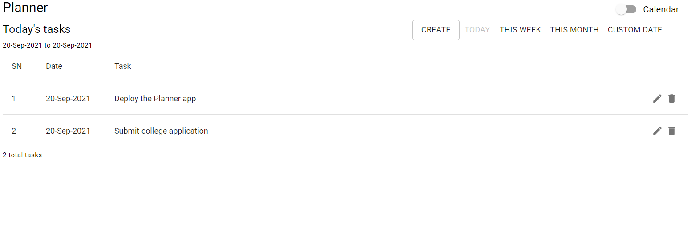
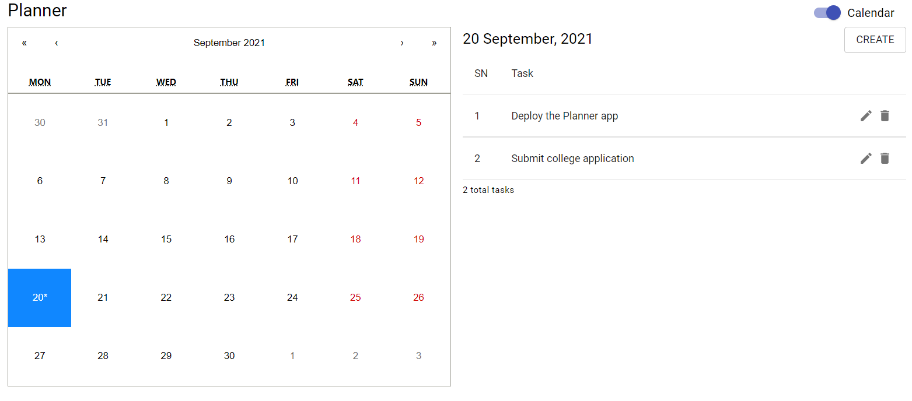

# The Planner

1. [Introduction](#introduction)
2. [Getting Started](#getting-started)
3. [Usage](#usage)
4. [Screenshots](#screenshots)
5. [Dependencies](#dependencies)
6. [Technical Notes](#technical-notes)

## Introduction

The Planner is a small project that helps you keep track of your engagements.

Using the application, you can:
1. Add a planned task for a date.
2. Edit or delete tasks.
3. View tasks for today, this week, this month, or a custom date.
4. Switch between **Calendar** or **List** views.

## Getting Started

1. Clone the repo.

  `git clone`

2. Go to the project directory and install all the front-end dependencies using:

  `yarn`

3. Run the front-end using:

  `yarn start`

4. Change the directory to `/api` and install all the back-end dependencies using:

  `pip3 install -r requirements.txt`

5. Create a `.flaskenv` file and add the following lines:

  ```
    FLASK_APP=api.py
    DATABASE=<name_of_your_database>
    DATABASE_HOST=<database_host_url>
  ```

6. Run the back-end using:

  `flask run`

The app runs by default on http://localhost:3000

## Usage

The home page opens with **Today's tasks** in the **List** view. In the application, you can:

1. Add, edit, or delete tasks.

2. Toggle between **Calendar** and **List** views.

3. Choose **Today**, **This Week**, **This Month**, or **Custom Date** range to display the list of tasks.


## Screenshots

1. Home page



2. Calendar view



## Dependencies

### Tools

1. [Yarn](https://yarnpkg.com/)
2. [Python3+](https://www.python.org/downloads/)
3. [Pip](https://pip.pypa.io/en/stable/)
4. [MongoDB](https://www.mongodb.com/)

### Front-end

1. @date-io/date-fns 1.x
2. @material-ui/core ^4.12.3
3. @material-ui/icons ^4.11.2
4. @material-ui/pickers ^3.3.10
5. date-fns ^2.23.0
6. react ^17.0.2
7. react-calendar ^3.4.0

### Back-end

1. click==8.0.1
2. colorama==0.4.4
3. Flask==2.0.1
4. itsdangerous==2.0.1
5. Jinja2==3.0.1
6. MarkupSafe==2.0.1
7. pymongo==3.12.0
8. python-dotenv==0.19.0
9. Werkzeug==2.0.1

## Technical Notes

1. Time addition for tasks coming in the next version.
